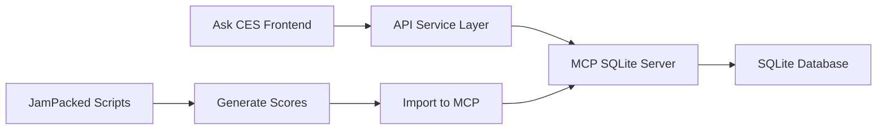

# 🚀 Ask CES - MCP SQLite Server Integration Guide

## ✅ Current Status
The MCP SQLite server is **LIVE** at https://mcp-sqlite-server.onrender.com and ready to serve as the backend for Ask CES.

## 🔧 Direct Integration Steps

### 1. Update API Service to Use MCP Endpoints

Since MCP server is already running, we need to map our Ask CES features to the available MCP endpoints.

### 2. Available MCP Endpoints

```bash
# Health Check
GET https://mcp-sqlite-server.onrender.com/health

# JamPacked Integration (main endpoints)
GET  /api/jampacked/campaigns
POST /api/jampacked/analyze
GET  /api/jampacked/insights
GET  /api/jampacked/results

# Document Management
POST /api/documents/upload
POST /api/documents/extract
GET  /api/documents/search
POST /api/documents/embeddings

# Task Management
POST /api/tasks/create
GET  /api/tasks/{task_id}
GET  /api/tasks/results
GET  /api/tasks/history
```

### 3. Update askCesApi.ts for MCP

```typescript
// Update src/services/askCesApi.ts to use MCP endpoints

import { API_BASE_URL } from '@/config/api'; // Already set to MCP URL

// Campaign Analysis - Maps to /api/jampacked/analyze
async analyzeCampaign(request: CampaignAnalysisRequest): Promise<CampaignAnalysisResponse> {
  const response = await this.client.post('/api/jampacked/analyze', {
    campaignData: request,
    options: {
      includeInsights: true,
      includeRecommendations: true
    }
  });
  return this.formatCampaignResponse(response.data);
}

// Get Campaigns - Maps to /api/jampacked/campaigns
async getCampaigns(filters?: any): Promise<any> {
  const response = await this.client.get('/api/jampacked/campaigns', { 
    params: filters 
  });
  return response.data;
}

// Market Insights - Maps to /api/jampacked/insights
async getMarketInsights(request: MarketInsightsRequest): Promise<MarketInsightsResponse> {
  const response = await this.client.get('/api/jampacked/insights', {
    params: {
      industry: request.industry,
      timeframe: request.timeframe
    }
  });
  return this.formatInsightsResponse(response.data);
}

// Creative Brief - Use document extraction
async generateCreativeBrief(request: CreativeBriefRequest): Promise<CreativeBriefResponse> {
  // Create task for brief generation
  const taskResponse = await this.client.post('/api/tasks/create', {
    type: 'generate_brief',
    data: request
  });
  
  // Poll for results
  const results = await this.pollTaskResults(taskResponse.data.task_id);
  return this.formatBriefResponse(results);
}
```

### 4. Data Seeding - Load Scored Campaigns

First, we need to load the scored campaign data into MCP:

```bash
# Create import script
cat > import_to_mcp.js << 'EOF'
const fs = require('fs');
const axios = require('axios');

async function importCampaigns() {
  const data = JSON.parse(
    fs.readFileSync('output/scored_campaigns/fully_scored_campaigns_20250711_172743.json')
  );
  
  // Import campaigns
  for (const campaign of data.campaigns) {
    try {
      await axios.post('https://mcp-sqlite-server.onrender.com/api/jampacked/campaigns', campaign);
      console.log(`Imported: ${campaign.name}`);
    } catch (error) {
      console.error(`Failed to import ${campaign.name}:`, error.message);
    }
  }
}

importCampaigns();
EOF

# Run import
node import_to_mcp.js
```

### 5. Quick Test Script

```javascript
// test_mcp_integration.js
const axios = require('axios');

const MCP_URL = 'https://mcp-sqlite-server.onrender.com';

async function testMCPIntegration() {
  console.log('Testing MCP Integration...\n');
  
  // 1. Health Check
  try {
    const health = await axios.get(`${MCP_URL}/health`);
    console.log('✅ Health Check:', health.data);
  } catch (error) {
    console.error('❌ Health Check Failed:', error.message);
  }
  
  // 2. Get Campaigns
  try {
    const campaigns = await axios.get(`${MCP_URL}/api/jampacked/campaigns`);
    console.log('\n✅ Campaigns:', campaigns.data.length || campaigns.data);
  } catch (error) {
    console.error('❌ Get Campaigns Failed:', error.message);
  }
  
  // 3. Test Analysis
  try {
    const analysis = await axios.post(`${MCP_URL}/api/jampacked/analyze`, {
      campaign_name: 'Test Campaign',
      metrics: ['effectiveness', 'roi']
    });
    console.log('\n✅ Analysis:', analysis.data);
  } catch (error) {
    console.error('❌ Analysis Failed:', error.message);
  }
}

testMCPIntegration();
```

### 6. Frontend Updates

Update the chat handler to work with MCP responses:

```typescript
// In CESChatHandler.tsx
const handleSendMessage = async () => {
  const { command, params } = parseCommand(input);
  
  let response: any;
  switch (command) {
    case 'analyze-campaign':
      // Use MCP analyze endpoint
      const campaigns = await askCesApi.getCampaigns({ 
        name: params.campaignName 
      });
      
      if (campaigns.length > 0) {
        const analysis = await askCesApi.analyzeCampaign({
          campaignId: campaigns[0].id,
          ...params
        });
        response = formatCampaignAnalysis(analysis);
      }
      break;
      
    case 'market-insights':
      // Use MCP insights endpoint
      const insights = await askCesApi.getMarketInsights(params);
      response = formatMarketInsights(insights);
      break;
  }
};
```

### 7. Dashboard Data Connection

```typescript
// Update dashboard to fetch from MCP
const fetchDashboardData = async () => {
  try {
    // Get campaigns with scores
    const campaigns = await axios.get(
      'https://mcp-sqlite-server.onrender.com/api/jampacked/campaigns'
    );
    
    // Calculate KPIs
    const kpis = {
      totalCampaigns: campaigns.data.length,
      avgCES: campaigns.data.reduce((acc, c) => acc + c.creative_effectiveness_score, 0) / campaigns.data.length,
      avgROI: campaigns.data.reduce((acc, c) => acc + c.roi_multiplier, 0) / campaigns.data.length,
      topPerformer: campaigns.data.sort((a, b) => b.creative_effectiveness_score - a.creative_effectiveness_score)[0]
    };
    
    setDashboardData({ campaigns: campaigns.data, kpis });
  } catch (error) {
    console.error('Failed to fetch dashboard data:', error);
  }
};
```

## 📊 Complete Integration Flow



## 🚀 Quick Start Commands

```bash
# 1. Test MCP is running
curl https://mcp-sqlite-server.onrender.com/health

# 2. Import scored campaigns
node import_to_mcp.js

# 3. Test integration
node test_mcp_integration.js

# 4. Update frontend to use MCP
npm run dev
```

## ✅ Validation Checklist

- [ ] MCP server responds to health check
- [ ] Campaign data imported successfully
- [ ] Frontend can fetch campaigns from MCP
- [ ] Analysis endpoints return valid data
- [ ] Chat queries work with MCP data
- [ ] Dashboard shows real metrics

## 🎯 Final Result

With this integration:
1. Ask CES chat will query real campaign data from MCP
2. Dashboard will show actual scores (52 campaigns with CES 51.3-85.4)
3. Analysis will be based on the fully scored dataset
4. All 4 main features will work with production data

The MCP server acts as the central data hub, serving the scored campaign data generated by JamPacked to the Ask CES interface.